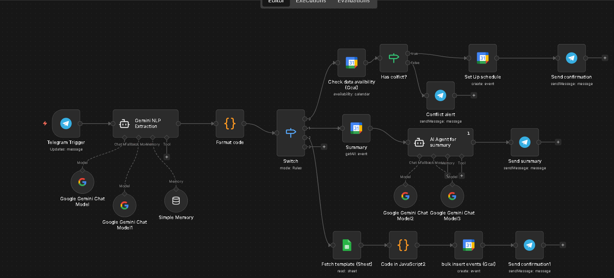
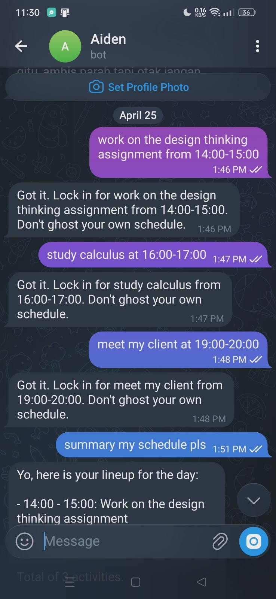
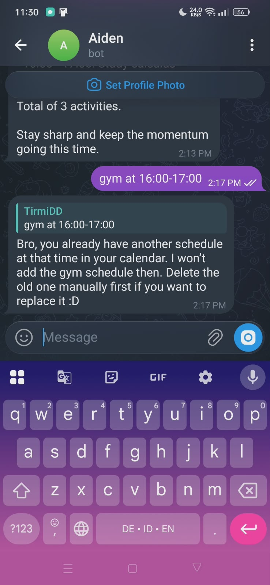
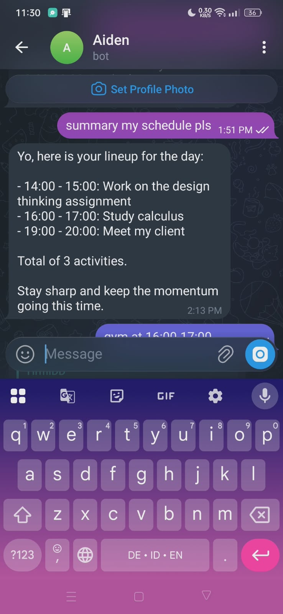

# AI Schedule Manager 📅
### A Telegram-based scheduling assistant that turns natural language into Google Calendar events — with built-in conflict detection and bulk scheduling.

---

## Overview

Managing a schedule manually means context-switching between apps, clicking through date pickers, and still occasionally double-booking yourself because you forgot to check.

This project eliminates that overhead. Instead of opening Google Calendar, you send a message on Telegram. The rest is automated.

> **Stack:** Telegram Bot → n8n → Gemini API → Google Calendar API + Google Sheets API

---

## How It Works

*Full automation pipeline: Telegram trigger → Gemini NLP extraction → conflict check → Google Calendar*

**1. Send a natural language command via Telegram**  
No specific format required. The AI handles language detection and responds in the same language as your input.

**2. Gemini extracts structured data**  
Parses your message into a JSON payload containing title, date, start time, and end time.

**3. Conflict check runs before anything gets written**  
n8n queries Google Calendar for the requested time slot. If an overlap is detected, the workflow stops and sends a rejection message via Telegram. No silent overwrites.

**4. Event is created and confirmed**  
If the slot is clear, n8n writes the event to Google Calendar and sends a confirmation back on Telegram.

*Natural language input → event created and confirmed on Telegram*

---

## Features

**Natural language scheduling**  
Send commands like "work on the design thinking assignment from 14:00-15:00" or "jadwalin belajar statistika besok jam 8 malem" — no format enforced, bilingual input supported.

**Auto conflict detection**  
Before writing any event, the system checks availability first. If the slot is already taken, the bot rejects the request immediately and tells you to resolve it manually — no silent overwrites, no double-booking.

*Conflict detected at 16:00-17:00 — request rejected with a clear explanation*

**Bulk template scheduling**  
A single trigger command reads a predefined weekly schedule from Google Sheets and pushes all events into Google Calendar at once — useful for recurring weekly routines that would otherwise require manual entry every week.

**AI daily briefing**  
On request, Gemini fetches all events for the day from Google Calendar, processes them, and returns a readable summary via Telegram — not a raw data dump, but an actual briefing.

*"summary my schedule pls" → full day briefing with total activity count*

---

## Limitations (v1.0)

- **Reactive, not proactive.** The system only runs when triggered. It doesn't remind you to plan or initiate scheduling on its own.
- **No rescheduling command yet.** Moving an existing event requires manual deletion in Google Calendar first, then re-adding via the bot.
- **Single user setup.** Credentials and calendar IDs are hardcoded — not plug-and-play for others without configuration.

---

## Setup

> Detailed setup guide coming soon.  
> Workflow JSON available in `/workflow` — import directly into your n8n instance.

**You'll need:**
- n8n instance (cloud or self-hosted)
- Telegram Bot Token
- Google Gemini API key
- Google Calendar API credentials
- Google Sheets (for bulk template feature)

---

*Part of a personal automation series — building systems to reduce daily friction one workflow at a time.*
